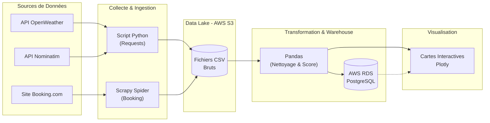

# KAYAK - Recommandation de destination en France

## Objectif

Recommander les meilleures destinations de vacances en France selon deux critères principaux :
- **La météo** : température, précipitations et vent sur les 7 prochains jours.
- **Les hôtels** : offre hôtelière, notes des utilisateurs et description.

Le projet couvre la collecte de données (APIs & Scraping), le stockage dans un Data Lake (S3), le nettoyage et le chargement dans un Data Warehouse (RDS), et la visualisation des résultats.

## Architecture
Le flux de données suit l'architecture suivante :

1. **Extraction (Extract)** :
   - **Météo** : récupération des données via l'API *OpenWeatherMap* et coordonnées GPS via *Nominatim*.
   - **Hôtels** : scraping du site *Booking.com* à l'aide du framework **Scrapy**.
2. **Stockage (Data Lake)** :
   - Stockage des données brutes et nettoyées (`.csv`) sur **AWS S3**.
3. **Chargement (Load)** :
   - Ingestion des données consolidées dans une base de données SQL sur **AWS RDS** (PostgreSQL).
4. **Visualisation** :
   - Création de cartes interactives avec **Plotly** pour afficher le Top 5 des destinations et les 20 meilleurs hôtels.



```mermaid
graph TD

    %% ====================
    %% DOMAINES ENTREPRISE
    %% ====================
    subgraph CLIENT_APP [🧭 Frontend / Application Client]
        VIZ["Plotly Dashboards<br/>Cartes Interactives"]
    end

    subgraph DATA_SOURCES [🌍 External Data Providers]
        WEATHER_API["OpenWeather API"]
        NOMINATIM_API["Nominatim API"]
        BOOKING_WEB["Booking.com Website"]
    end

    subgraph DATA_INGESTION [📥 Data Ingestion Layer]
        INGEST_PY["Python ETL Scripts<br/>Requests + BS4"]
        %% connect sources to ingestion
        WEATHER_API --> INGEST_PY
        NOMINATIM_API --> INGEST_PY
        BOOKING_WEB --> INGEST_PY
    end

    subgraph RAW_DATALAKE [🛢️ AWS S3 – Raw Zone]
        RAW_CSV["raw_data/*.csv"]
        INGEST_PY --> RAW_CSV
    end

    subgraph PROCESSING [⚙️ Processing & Compute Layer]
        PAN["Pandas Cleaning<br/>Feature Engineering"]
        RAW_CSV --> PAN
    end

    subgraph CURATED_ZONE [💾 AWS S3 – Curated Zone (optionnel)]
        CURATED["curated/*.csv"]
        PAN -. optional .-> CURATED
    end

    subgraph DATA_WAREHOUSE [🏛️ AWS RDS – PostgreSQL]
        DW_TABLE["Table: kayak_destinations"]
        PAN --> DW_TABLE
    end

    subgraph ANALYTICS [📊 Analytics Layer]
        BI["Dashboards / Exploration<br/>via SQL + Python"]
        DW_TABLE --> BI
    end

    BI --> VIZ
```